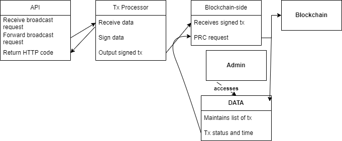

# Problem 6: Transaction Broadcaster Service
This solution treats the EVM-compatible blockchain as a black box.

The system consists of:
  * API that interacts with users
  * Main broadcaster service logic (3 layers)
    1. Layer that interacts with API
    2. Layer that interacts with blockchain nodes
    3. Data storage layer
  * Admin interface

---

---
# Detailed description of layers
## API layer:
  * Receives broadcast requests (`message_type`, `data`)
  * Forwards broadcast requests to the main broadcaster service
  * Upon successful forward, returns HTTP `200`
  * Otherwise, returns HTTP `4xx`-`5xx`

## Broadcaster service
### Transaction processing
  * Receives broadcast requests from API layer
  * Signs `data`
  * Outputs `signed transaction` to blockchain-side layer
### Blockchain-side
  * Receives `signed transaction` from tx processor
  * Send PRC request to a blockchain node
  * Also sends PRC request on command
  * All PRC requests are logged in data layer
### Data layer
  * Maintains a list of transactions + status (`pending`, `success`, `failure`) + time of PRC request
  * On `failure`, retry (calls blockchain-side layer to retry)
  * If `pending` for more than 30s, retry (calls blockchain-side layer to retry)

## Admin interface
  * Access to [data layer](#data-layer)
